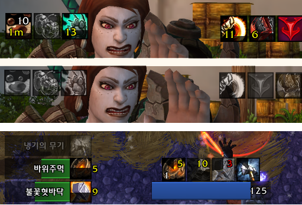

# 앞으로 해야될 것들..
* ~~오라 등록할때 딜레이 0.5초로 해둔것 딜레이 없이 등록할 수 있도록 수정 필요~~
* ~~반짝임 상세 조건~~
* ~~유닛 목록 다른 것들도 추가할 수 있도록 해야함~~
* ~~쿨다운 업데이트~~
* ~~토템류 업데이트~~
* ~~수치 기능 업데이트~~
* ~~직업 1차 자원 업데이트~~
* 직업 특별 2차 자원 업데이트
* 양조 시간차 업데이트
* 바 스플릿 기능 업데이트
* 공유 기능 업데이트
* 웬만큼 정리되면 영문화하여 정식으로 배포
* UI 설정 다시 한번 정리할 필요 있음
  * 설정 메뉴 정리
  * 공용설정, 개별설정 잘 구분 안되는 거 고민
* 트랜짓 드롭다운 목록 정리 보기 좋게 오더링하도록 수정 필요
* 아이콘 꿀렁거림 수정
* 불필요한 소스코드 정리

## 업데이트 사항

#### [2023.01.21] v10.0.2.02
- 쿨다운, 토템 정상화
- 반짝효과 상세조건 추가
- (추가) 직업 1차 자원 정상화

#### [2023.01.09] v10.0.2.01
- 버프, 디버프, 설정 UI 용군단에 맞춰 업데이트
- 특성에 따른 트래커 설정 다중화 기능 추가

#### [2022.12.11 21:00] v10.0.2.1
- 일단, 용군단에서 Aura 기능만 동작하도록 수정

# AuraTracker 로 이름 변경
오라,스킬,토템,HP,MP,직업자원에 대한 쿨다운 및 수치를 별도의 아이콘(바)으로 만들어 표시

)
)

## 주요 기능
- 사용자가 지정한 오라(버프, 디버프)가  `비활성화` 되었을 때 `흑백 아이콘` 으로 표시되며,   `활성화` 되었을 때 `컬러 아이콘(+쿨다운,중첩)` 으로 표시하는 애드온

#### 1. 오라(버프/디버프) 추적

#### 2. 스킬/아이템 쿨타임 추적

#### 3. 토템류 스킬 추적 
- 드루이드 : 꽃피우기
- 수도사 : 조각상, 원혼
- 마법사 : 마력의룬
- 주술사 : 토템
- 죽음의기사 : 되살아난 구울
- 사제 : 마귀
- 기타 토템 프레임이 나오는 것들

#### 4. 직업 별 1차 자원 추적 
- 마나, 기력, 소용돌이, 광기, 룬마력

#### 5. 직업 특별 자원 추적 (기능 복구 중)
- 죽기 룬, 콤보, 비전충전몰, 영혼조각 등
source: imgur.com

#### 6. 양조 시간차 추적 (기능 복구 중)
- 양조의 시간차 누적데미지를 표시

## 설정 방법
- 설정창 팝업 명령어는 /at , /auratracker , /ㅁㅅ