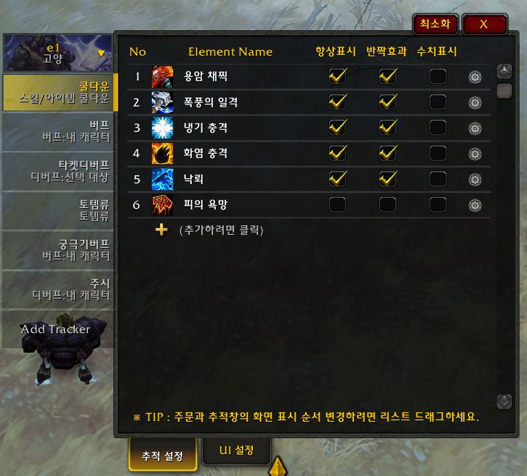
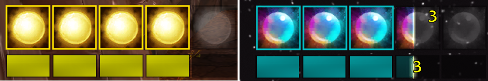
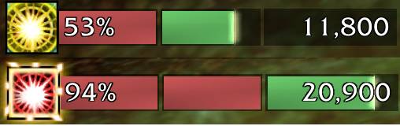

# 앞으로 해야될 것들..
* 웬만큼 정리되면 영문화하여 정식으로 배포
* 트랜짓 드롭다운 목록 정리 보기 좋게 오더링하도록 수정 필요
* 아이콘 꿀렁거림 수정
* 불필요한 소스코드 정리
* 아이콘 이동 켜고 설정 바꾸면 바로 반영 안되는 오류가 있는 것 같음

<!-- * 주문 순서 바꾸고 세부 설정 제대로인식 못함 -->
<!-- * 주문 KEY 로 매칭하니까 똑같은 이름의 주문이면 제대로 동작암함 -> ID 로 동작하게 해야함 -->

## 업데이트 사항

#### [2023.02.10] v10.0.5.04
- 영문화 1차
- 체크 버튼 -> 토글 버튼으로 변경
- 색상 설정 옵션에서 컬러 코드 입력 기능 추가
- 바 설정에서 바 위치와 애니메이션 방향 분리
- [오류수정] 오라에서 타겟 변경 시 제대로 동작하지 않던 문제 수정

#### [2023.02.10] v10.0.5.03
- 문자열로 설정 공유하는 기능 업데이트
- 설정 옵션 추가 : 쿨다운 경계선 반짝임 색상 설정
- 설정 옵션 추가 : 추적:쿨다운에 대한 자원 부족, 사정거리 밖일 때 색상 설정
- 설정 옵션 추가 : 마우스 오버 시 주문툴팁 표시 추가
- 기능 안정화

#### [2023.02.04] v10.0.5.02
- 디버깅 코드 삭제

#### [2023.02.04] v10.0.5.01
- 직업 1차 기본 자원 업데이트
- 직업 2차 특수 자원 업데이트
  -  콤보류, 죽기 룬, 비전충전몰, 영혼조각, 기원사 정수 
- 양조 시간차 업데이트
- 비전투시 아이콘 표시 기능 추가 (위치: UI설정>아이콘,바>정렬 및 표시 여부)
- 시간, 수치 축약 기능 추가
- 아이콘 이미지 변경 기능 추가
- 기본 자원 분할 기능가추가

#### [2023.01.21] v10.0.2.02
- 쿨다운, 토템 정상화
- 반짝효과 상세조건 추가

#### [2023.01.09] v10.0.2.01
- 버프, 디버프, 설정 UI 용군단에 맞춰 업데이트
- 특성에 따른 트래커 설정 다중화 기능 추가

#### [2022.12.11 21:00] v10.0.2.1
- 일단, 용군단에서 Aura 기능만 동작하도록 수정

# AuraTracker 로 이름 변경
오라,스킬,토템,HP,MP,직업자원에 대한 쿨다운 및 수치를 별도의 아이콘(바)으로 만들어 표시

## 주요 기능
- 사용자가 지정한 오라(버프, 디버프)가  `비활성화` 되었을 때 `흑백 아이콘` 으로 표시되며,   `활성화` 되었을 때 `컬러 아이콘(+쿨다운,중첩)` 으로 표시하는 애드온

#### 1. 오라(버프/디버프) 추적

#### 2. 스킬/아이템 쿨타임 추적

#### 3. 토템류 스킬 추적 
- 드루이드 : 꽃피우기
- 수도사 : 조각상, 원혼, 폭대불
- 마법사 : 마력의룬
- 주술사 : 토템
- 죽음의기사 : 되살아난 구울
- 사제 : 마귀
- 성기사 : 신성화
- 기타 토템 프레임이 나오는 것들

#### 4. 직업 별 1차 자원 추적 
- 마나, 기력, 소용돌이, 광기, 룬마력, 분노 등

#### 5. 직업 특별 자원 추적
- 죽기 룬, 콤보, 비전충전물, 영혼조각, 기원사 정수 등

#### 6. 양조 시간차 추적 
- 양조의 시간차 누적데미지를 표시

## 설정 방법
- 설정창 팝업 명령어는 /at , /auratracker , /ㅁㅅ
