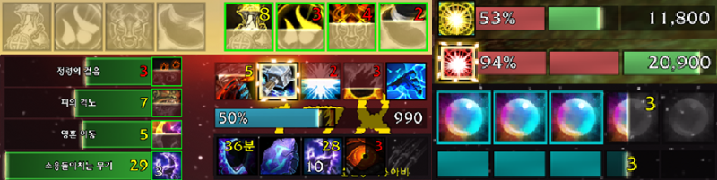

# Download latest releases
* [Curseforge (In English)](https://www.curseforge.com/wow/addons/auratracker)
* [WoW Inven (In Korean)](https://wow.inven.co.kr/dataninfo/addonpds/detail.php?idx=9396&rurl=%2Fdataninfo%2Faddonpds%2Flist.php%3F)

# 앞으로 해야될 것들..
* 영문화 : 문법 교정 및 더 짧게 수정
* ~~트랜짓 드롭다운 목록 정리 보기 좋게 오더링하도록 수정 필요~~
* 아이콘 꿀렁거림 수정
  * 0.5픽셀단위로 움직이는걸로 완화했지만, 근본적인 해결방안은 아님
* 불필요한 소스코드 정리
* ~~아이콘 이동 켜고 설정 바꾸면 바로 반영 안되는 오류가 있는 것 같음~~
  * 방식을 크게 변경해야할 것 같은데.. 너무 큰 작업이라서 일단 우회적으로 해결.. 이동 옵션 껏다가 켜는걸로..

# AuraTracker (구 AuraTracking)
오라,스킬,토템,HP,MP,직업자원에 대한 쿨다운 및 수치를 별도의 아이콘(바)으로 만들어 표시

## 주요 기능
사용자가 지정한 오라(버프, 디버프)가  `비활성화` 되었을 때 `흑백 아이콘` 으로 표시되며,   `활성화` 되었을 때 `컬러 아이콘(+쿨다운,중첩)` 으로 표시하는 애드온

#### 1. 오라(버프/디버프) 추적

#### 2. 스킬/아이템 쿨타임 추적

#### 3. 토템류 스킬 추적 
- 드루이드 : 꽃피우기
- 수도사 : 조각상, 원혼, 폭대불
- 마법사 : 마력의룬
- 주술사 : 토템
- 죽음의기사 : 되살아난 구울
- 사제 : 마귀
- 성기사 : 신성화
- 기타 토템 프레임이 나오는 것들

#### 4. 직업 별 1차 자원 추적 
- 마나, 기력, 소용돌이, 광기, 룬마력, 분노 등

#### 5. 직업 특별 자원 추적
- 죽기 룬, 콤보, 비전충전물, 영혼조각, 기원사 정수 등

#### 6. 양조 시간차 추적 
- 양조의 시간차 누적데미지를 표시

## 설정 방법
- 설정창 팝업 명령어는 /at , /auratracker , /ㅁㅅ

## 업데이트 사항

#### [2023.03.19] v10.0.5.10
- [기능추가] 글로벌 쿨다운 표시 여부 설정 추가

#### [2023.03.17] v10.0.5.09
- [기능추가] 트래커 개별로 프로필 내보내기/가져오기 기능 추가

#### [2023.03.10] v10.0.5.08
- [기능추가] 최근시전 주문 목록 보기 기능 추가(+ 드래그로 주문 추가)
- [기능추가] 아이콘 테두리 굵기 조정 옵션 추가
- [기능추가] 주문 숨김 시 빈 공간으로 표시하는 옵션 추가 
- [오류 수정] 시간 차 기능이 동작하지 않는 문제 수정

#### [2023.03.03] v10.0.5.07
- [기능추가] 공격대일때 기능 비활성화하는 설정 추가
- [오류수정] 내주문만 추적하는 기능이 옳바르게 동작하지 않던 문제 수정
- [오류 수정] 아이콘 크기 및 이동 좌표에 대한 보정 오차 수정 -> 오차 수정으로 인하여 아이콘 크기 2px 정도 작아짐
- 이동 옵션에 대한 사용성 개선

#### [2023.02.18] v10.0.5.06
- [기능추가] 새로운 추적창 생성 시 공용설정, 개별설정 중 선택 팝업 추가

#### [2023.02.13] v10.0.5.05
- [오류수정] 한글 클라이언트에서는 한글이 나오도록 수정
- [오류수정] 특성 변경 시 오류창이 팝업되는 문제 수정
- [오류수정] 새로운 추적창 추가 시 추적창 목록이 전체 목록으로 변경되는 문제 수정

#### [2023.02.12] v10.0.5.04
- 영문화 1차
- 체크 버튼 -> 토글 버튼으로 변경
- 색상 설정 옵션에서 컬러 코드 입력 기능 추가
- 바 설정에서 바 위치와 애니메이션 방향 분리
- [오류수정] 오라추적에서 타겟 변경 시 제대로 동작하지 않던 문제 수정
- [오류수정] 추적창 설정에서 추적창 순서 변경이 제대로 동작하지 않던 문제 수정

#### [2023.02.10] v10.0.5.03
- 문자열로 설정 공유하는 기능 업데이트
- 설정 옵션 추가 : 쿨다운 경계선 반짝임 색상 설정
- 설정 옵션 추가 : 추적:쿨다운에 대한 자원 부족, 사정거리 밖일 때 색상 설정
- 설정 옵션 추가 : 마우스 오버 시 주문툴팁 표시 추가
- 기능 안정화

#### [2023.02.04] v10.0.5.02
- 디버깅 코드 삭제

#### [2023.02.04] v10.0.5.01
- 직업 1차 기본 자원 업데이트
- 직업 2차 특수 자원 업데이트
  -  콤보류, 죽기 룬, 비전충전몰, 영혼조각, 기원사 정수 
- 양조 시간차 업데이트
- 비전투시 아이콘 표시 기능 추가 (위치: UI설정>아이콘,바>정렬 및 표시 여부)
- 시간, 수치 축약 기능 추가
- 아이콘 이미지 변경 기능 추가
- 기본 자원 분할 기능가추가

#### [2023.01.21] v10.0.2.02
- 쿨다운, 토템 정상화
- 반짝효과 상세조건 추가

#### [2023.01.09] v10.0.2.01
- 버프, 디버프, 설정 UI 용군단에 맞춰 업데이트
- 특성에 따른 트래커 설정 다중화 기능 추가

#### [2022.12.11] v10.0.2.1
- 일단, 용군단에서 Aura 기능만 동작하도록 수정
